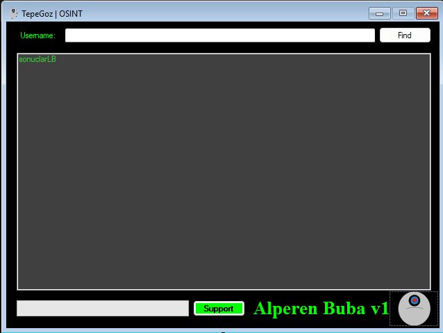

<h1>👁️ TepeGoz | OSINT Aracı</h1>

TepeGoz, kullanıcı adlarını popüler sosyal medya platformlarında hızlı bir şekilde taramak için geliştirilmiş, hafif ve taşınabilir bir OSINT (Açık Kaynak İstihbaratı) aracıdır.

<h2>🚀 Özellikler</h2>
<ul>
  <li><b>Hızlı Tarama:</b> Hedef kullanıcı adını saniyeler içinde birden fazla platformda kontrol eder.</li>
  <li><b>Taşınabilir:</b> Kurulum gerektirmez, tek bir .exe dosyası ile çalışır.</li>
  <li><b>Minimalist:</b> Sistem kaynaklarını yormaz.</li>
  <li><b>Özelleştirilebilir:</b> sites.json dosyasını düzenleyerek dilediğin platformu kolayca ekleyebilirsin.</li>
</ul>
<h2>🛠️ Nasıl Kullanılır?</h2>
<ol>
  <li>Programı çalıştırın.</li>
  <li>"Kullanıcı Adı" kısmına aratmak istediğiniz ismi yazın.</li>
  <li>Bul butonuna basın.</li>
  <li>Program taramayı tamamladığında, bulunan profiller sonuç ekranında listelenecektir.</li>
</ol>
<h2>⚙️ Yapılandırma</h2>

Arama yapılacak siteleri güncellemek için programın yanındaki sites.json dosyasını düzenleyebilirsiniz. JSON formatı şu şekildedir:

======================================================

<pre>
{
  "Siteler": [
    { "Ad": "Instagram", "Url": "https://www.instagram.com/{user}/" },
    { "Ad": "GitHub", "Url": "https://github.com/{user}/" }
  ]
}
</pre>

=======================================================

<h2>☕ Destek Ol</h2>

Bu projeyi geliştirmeye devam etmemi istersen veya emeğimi desteklemek istersen beni sosyal medya platformlarından takip edebilirsiniz:

